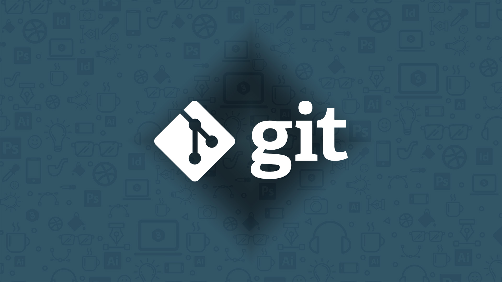

# Введение

Эта глава посвящена началу работы с Git. Мы начнем с объяснения некоторых сведений об инструментах контроля версий, затем перейдем к тому, как запустить Git в вашей системе, и, наконец, как настроить его для начала работы. В конце этой главы вы должны понять, зачем нужен Git, почему вы должны его использовать, и вы должны быть полностью готовы к этому.

# О контроле версий

Что такое "контроль версий", и почему это должно вас волновать? Контроль версий - это система, которая записывает изменения в файле или наборе файлов с течением времени, чтобы впоследствии вы могли вспомнить конкретные версии. В примерах, приведенных в этой книге, в качестве файлов для контроля версий вы будете использовать исходный код программного обеспечения, хотя в действительности это можно делать практически с любым типом файлов на компьютере.

Если вы графический или веб-дизайнер и хотите сохранить каждую версию изображения или макета (а вы наверняка этого хотите), то система контроля версий (СКВ) - очень разумное решение. Она позволяет вернуть выбранные файлы к предыдущему состоянию, вернуть весь проект к предыдущему состоянию, сравнить изменения во времени, посмотреть, кто последний раз изменил что-то, что может вызвать проблему, кто и когда ввел проблему, и многое другое. Использование VCS также обычно означает, что если вы что-то испортите или потеряете файлы, вы сможете легко восстановить их. Кроме того, вы получаете все это за очень небольшие накладные расходы.

## Локальные системы контроля версий

Многие люди предпочитают использовать метод контроля версий, копируя файлы в другой каталог (возможно, каталог с временной меткой, если они умны). Этот подход очень распространен, потому что он очень прост, но он также невероятно склонен к ошибкам. Легко забыть, в каком каталоге вы находитесь, и случайно записать не в тот файл или скопировать файлы, которые вы не хотели.

Чтобы справиться с этой проблемой, программисты давно разработали локальные VCS, которые имели простую базу данных, хранящую все изменения файлов под контролем ревизий.

Одним из самых популярных инструментов VCS была система под названием RCS, которая и сегодня распространяется на многих компьютерах. RCS работает путем хранения наборов патчей (то есть различий между файлами) в специальном формате на диске; затем она может воссоздать вид любого файла в любой момент времени путем сложения всех патчей.

## Централизованные системы контроля версий

Следующая серьезная проблема, с которой сталкиваются люди, - это необходимость сотрудничества с разработчиками на других системах. Для решения этой проблемы были разработаны централизованные системы контроля версий (CVCS). Эти системы (такие как CVS, Subversion и Perforce) имеют один сервер, на котором хранятся все версионные файлы, и несколько клиентов, которые проверяют файлы из этого центрального места. В течение многих лет это был стандарт для контроля версий.

Такая система имеет много преимуществ, особенно по сравнению с локальными VCS. Например, каждый в определенной степени знает, что делают все остальные участники проекта. Администраторы имеют тонкий контроль над тем, кто что может делать, и администрировать CVCS гораздо проще, чем работать с локальными базами данных на каждом клиенте.

Однако у этой системы есть и серьезные недостатки. Наиболее очевидным из них является единая точка отказа, которую представляет собой централизованный сервер. Если этот сервер выйдет из строя на час, то в течение этого часа никто не сможет ни сотрудничать, ни сохранять версионные изменения того, над чем они работают. Если жесткий диск, на котором находится центральная база данных, будет поврежден, а резервные копии не будут сохранены, вы потеряете абсолютно все - всю историю проекта, за исключением отдельных снимков, которые люди сохранили на своих локальных машинах. Локальные VCS страдают от той же проблемы - когда вся история проекта хранится в одном месте, вы рискуете потерять все.

## Распределенные системы контроля версий

Здесь на помощь приходят распределенные системы контроля версий (DVCS). В DVCS (таких как Git, Mercurial, Bazaar или Darcs) клиенты не просто проверяют последний снимок файлов; скорее, они полностью зеркалируют репозиторий, включая всю его историю. Таким образом, если какой-либо сервер умрет, а эти системы сотрудничали через этот сервер, любой из клиентских репозиториев может быть скопирован на сервер для восстановления. Каждый клон на самом деле является полной резервной копией всех данных.

Более того, многие из этих систем прекрасно справляются с наличием нескольких удаленных репозиториев, с которыми они могут работать, так что вы можете сотрудничать с разными группами людей разными способами одновременно в рамках одного проекта. Это позволяет создавать несколько типов рабочих процессов, которые невозможны в централизованных системах, например, иерархические модели.

# Краткая история Git

Как и многие великие вещи в жизни, Git начался с небольшого творческого разрушения и жарких споров.

Ядро Linux - это проект программного обеспечения с открытым исходным кодом довольно большого масштаба. В первые годы поддержки ядра Linux (1991-2002) изменения в программном обеспечении передавались в виде патчей и архивных файлов. В 2002 году проект ядра Linux начал использовать проприетарную систему DVCS под названием BitKeeper.

В 2005 году отношения между сообществом разработчиков ядра Linux и коммерческой компанией, разработавшей BitKeeper, испортились, и статус бесплатного инструмента был аннулирован. Это побудило сообщество разработчиков Linux (и, в частности, Линуса Торвальдса, создателя Linux) разработать собственный инструмент, основанный на некоторых уроках, полученных при использовании BitKeeper. Некоторые цели новой системы были следующими:

1. Скорость

2. Простой дизайн

3. надежная поддержка нелинейной разработки (тысячи параллельных ветвей)

4. Полностью распределенная

5. Способность эффективно обрабатывать большие проекты, такие как ядро Linux (скорость и размер данных).

С момента своего появления в 2005 году Git развивался и совершенствовался, чтобы стать простым в использовании и при этом сохранить свои первоначальные качества. Он удивительно быстр, очень эффективен при работе с большими проектами и имеет невероятную систему ветвления для нелинейной разработки (см. Git Branching).

# Что такое Git?

Итак, что такое Git в двух словах? Это важный раздел для усвоения, потому что если вы понимаете, что такое Git и основы его работы, то эффективное использование Git будет для вас намного проще. Изучая Git, постарайтесь очистить свой разум от того, что вы можете знать о других ВКС, таких как CVS, Subversion или Perforce - это поможет вам избежать легкой путаницы при использовании инструмента. Несмотря на то, что пользовательский интерфейс Git довольно похож на эти другие VCS, Git хранит и обрабатывает информацию совершенно по-другому, и понимание этих различий поможет вам избежать путаницы при его использовании.

# Командная строка

Существует множество различных способов использования Git'а. Существуют оригинальные инструменты командной строки, а также множество графических пользовательских интерфейсов с различными возможностями. В этой книге мы будем использовать Git в командной строке. Во-первых, командная строка - это единственное место, где можно выполнить все команды Git'а - большинство графических интерфейсов для простоты реализуют лишь часть функциональности Git'а. Если вы знаете, как запустить версию командной строки, вы, вероятно, также сможете понять, как запустить версию графического интерфейса, в то время как обратное не обязательно верно. Кроме того, хотя выбор графического клиента - дело личного вкуса, у всех пользователей будут установлены и доступны инструменты командной строки.

Поэтому мы ожидаем, что вы будете знать, как открыть Terminal в macOS или Command Prompt или PowerShell в Windows. Если вы не знаете, о чем идет речь, возможно, вам придется остановиться и быстро изучить этот вопрос, чтобы вы могли следовать остальным примерам и описаниям в этой книге.

# Резюме

Вы должны иметь базовое понимание того, что такое Git и чем он отличается от любых централизованных систем контроля версий, которые вы, возможно, использовали ранее. У вас также должна быть рабочая версия Git'а в вашей системе, настроенная под ваши личные данные. Настало время изучить некоторые основы Git.